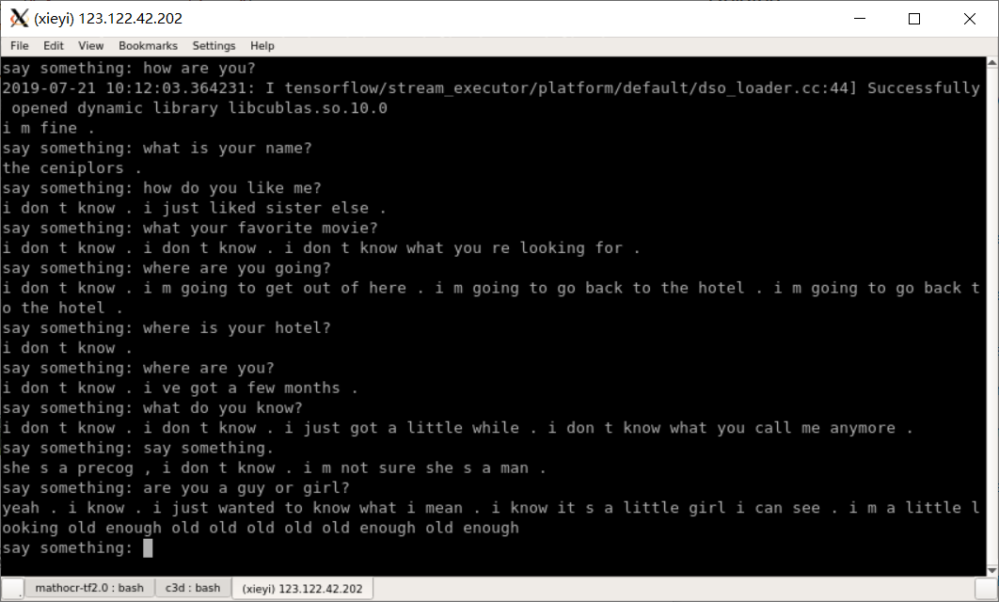

# chatbot-with-Transformer
an implement of chatbot with Transformer.

## how to train
train the transformer with the following command

```python
python3 train_chatbot.py
```

## how to predict
test the chatbot with the following command

```python
python3 Predictor.py
```

the chatting bot can replay your questions by printing the answers on the console. here is what it looks like. 




